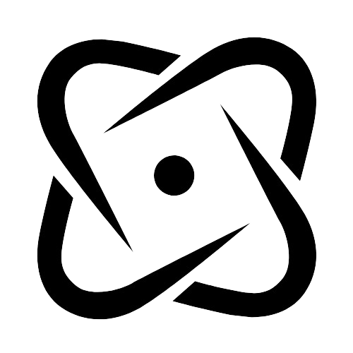

#Task Tracker App
This Task Tracker is a simple web application built using React with TypeScript. It allows users to add tasks with deadlines and mark them as completed when finished.

## [See the App!](https://achieve-tasktracker.netlify.app/)

##Features

- Add tasks with specified deadlines.
- Mark tasks as completed.
- Clean and intuitive user interface.

##Technologies Used

- React
- TypeScript
- HTML
- CSS

Created by Marina Muñoz
[Repository Link](https://github.com/marinamun/typescript-toDo)
